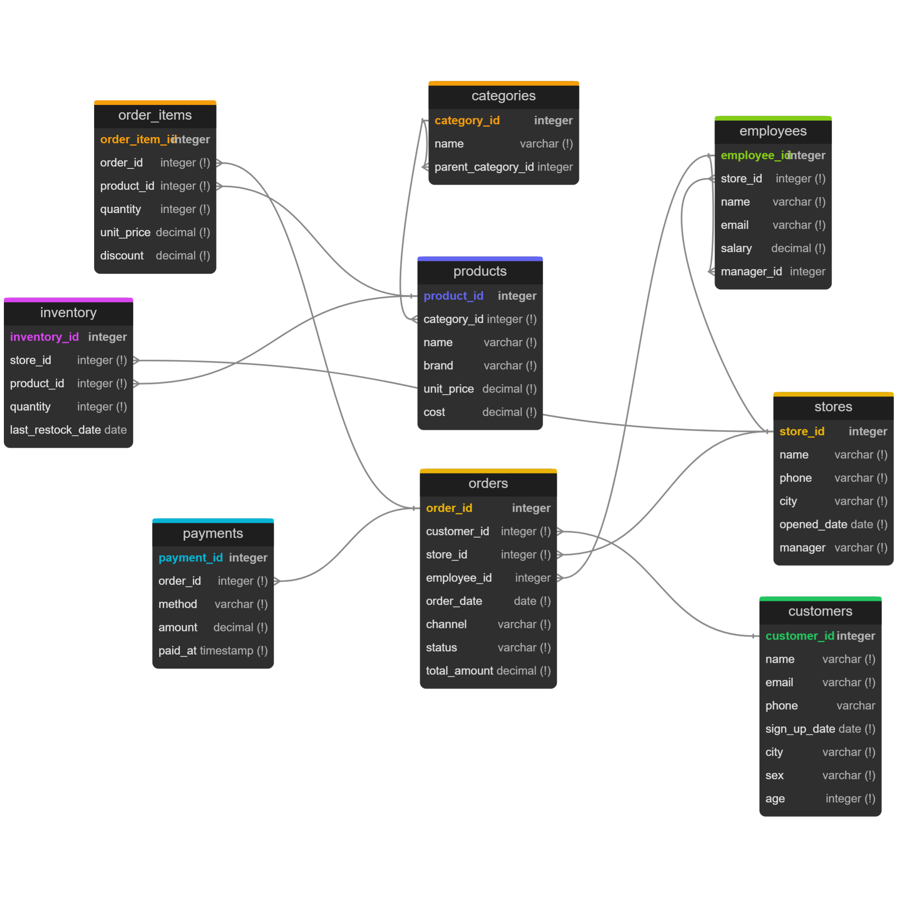

# Retail Analytics Data Warehouse

An end-to-end data project I'm building to learn how a real analytics stack fits together: a normalized OLTP database that mimics a retail chain's operational system, an ETL pipeline that loads it into a dimensional warehouse, advanced SQL analytics on top, and finally a BI dashboard.

I'm building this in phases and documenting the decisions as I go, including the ones I got wrong the first time.

---

## Architecture

```
OLTP (3NF)  →  ETL  →  Star Schema Warehouse  →  Reporting Views  →  Dashboard
```

| Layer              | What it does                                               | Status      |
| ------------------ | ---------------------------------------------------------- | ----------- |
| OLTP schema        | Normalized transactional tables — the "source system"     | Done        |
| Synthetic data     | 17k customers, 500 products, 94.5k orders over 3 years     | Done        |
| Star schema        | Fact and dimension tables for analytics                    | In progress |
| ETL                | Incremental load from OLTP into the warehouse              | Planned     |
| Analytics SQL      | Window functions, CTEs, recursive queries, cohort analysis | Planned     |
| Optimization       | Index tuning with before/after execution plans             | Planned     |
| Views & procedures | Reporting layer, stored procedures, triggers               | Planned     |
| Dashboard          | Power BI / Metabase on top of the views                    | Planned     |

---

## Tech stack

- **PostgreSQL 18** — database
- **Python 3** (`faker`, `pandas`, `psycopg2`) — data generation and ETL
- **dbdiagram.io / DBML** — schema as version-controlled code, diagram generated from it
- **VS Code** with the DBML ERD extension for previewing the diagram while editing

---

## Repository structure

```
├── docs/                  # ERD diagram + DBML source, design notes
├── schema/                # OLTP DDL (00_drop_tables.sql, 01_create_tables.sql)
├── etl/
│   ├── config.py          # All sizing knobs, date ranges, and the random seed
│   ├── generators/        # One module per table
│   ├── generate_data.py   # Orchestrator — runs generators in FK order, writes CSVs
│   └── load_data.py       # Bulk COPY into Postgres + sequence reset
├── sample_data/           # Generated CSVs (gitignored — reproducible from the script)
├── analytics/             # Advanced SQL queries
├── optimization/          # Index experiments and execution plans
├── dashboard/             # Dashboard file and screenshots
```

---

## Phase 1 — OLTP schema (done)

The operational schema is normalized to 3NF across nine tables:

`categories` · `stores` · `customers` · `products` · `employees` · `orders` · `order_items` · `inventory` · `payments`



The schema is written as DBML in [docs/schema.dbml](docs/schema.dbml) so it lives in version control and the diagram is generated from it rather than drawn by hand. The DDL is in [schema/01_create_tables.sql](schema/01_create_tables.sql).

### Design decisions

**`order_items` stores its own `unit_price`.** My first instinct was to join back to `products` for the price, but that breaks the moment a product's price changes — every historical order would silently be revalued. Storing the price at the time of sale keeps history correct.

**`categories.parent_category_id` is self-referencing.** This gives me a real category hierarchy (Electronics → Laptops) instead of a flat list. It also sets up the recursive CTE work later, where I want to roll sales up through every level of the tree.

**`employees.manager_id` is nullable and self-referencing.** It has to be nullable — the top-level manager has nobody above them, so a `NOT NULL` constraint would make the first row impossible to insert. Same recursive structure as categories, applied to an org chart.

**`orders.employee_id` is nullable.** Online orders have no salesperson attached. Rather than inventing a fake "web" employee, I let the column be null and treat it as a genuine absence.

**Composite unique constraints where the grain demands it.** `order_items` is unique on `(order_id, product_id)` — the same product shouldn't appear twice on one order; the quantity should increase instead. `inventory` is unique on `(store_id, product_id)` for the same reason: one stock row per product per store.

**`ON DELETE CASCADE` only on truly dependent rows.** Order items and payments cascade from `orders` because they have no meaning without the parent order. Nothing cascades from `customers` or `products` — deleting those should fail loudly rather than quietly destroying sales history.

**Check constraints on every domain column.** Quantities must be positive, prices and discounts non-negative, and `status` and `channel` are restricted to a known set of values. I'd rather the database reject bad data than discover it during analysis.

---

## Phase 2 — Synthetic data (done)

**490,445 rows across nine tables**, covering three years of trading (2023-08-13 → 2026-08-12) and $313.6M in gross revenue.

| Table | Rows | | Table | Rows |
| --- | ---: | --- | --- | ---: |
| `order_items` | 284,504 | | `products` | 500 |
| `orders` | 94,534 | | `employees` | 162 |
| `payments` | 86,194 | | `categories` | 36 |
| `customers` | 17,000 | | `stores` | 15 |
| `inventory` | 7,500 | | | |

Realistic data mattered far more than I expected. My first attempt used uniform random values everywhere, and the result was useless: every analytical query returned a flat line. There was nothing to *find*. So the generator ([etl/generators/](etl/generators/)) deliberately builds in the patterns I'll want to detect later.

### The patterns, and how they're produced

**Seasonality.** A weighted calendar biases order dates toward November and December. Measured on the data: November 2025 has 6,679 orders against October's 3,261 — a 2.05× lift, in line with real retail.

**Pareto demand.** Each product gets a hidden `popularity_weight` drawn from `random.paretovariate()`, used as the weight in `random.choices` when picking line items. I never hardcode which products are popular — the concentration emerges. Result: the top 20% of products account for 86% of revenue.

**Mixed customer behavior.** Every customer is assigned a hidden segment (`one_time`, `occasional`, `loyal`, `never_bought`) that determines how many orders they place. This produces a realistic long tail — mean 6.0 orders per customer, median 1, max 40 — and 1,227 customers who signed up and never purchased. Without this spread, cohort retention and RFM segmentation would have nothing to measure.

**Referential realism.** No order predates its store's opening date or its customer's signup. Online orders (39.8%) carry no `employee_id`. Payments exist only for orders that actually resolved, and always match the order total exactly.

### Design decisions

**Hidden attributes never reach the database.** `popularity_weight`, customer segment, and stock tier all exist only in Python — they're modelling inputs, not business data. A real `products` table has no "popularity" column; popularity is something you *derive* from sales. Keeping them out of the CSVs preserves that: the analytics in later phases have to discover these patterns rather than read them off a column.

**Orders and order_items are generated together.** `orders.total_amount` has to equal the real sum of its line items. Generating them in two independent passes would guarantee they never reconcile, so each order's items are built immediately and summed into the total.

**`COPY`, not `INSERT`.** [etl/load_data.py](etl/load_data.py) bulk-loads via `psycopg2`'s `copy_expert`. At ~490k rows, row-by-row inserts would take minutes for no benefit.

**Sequences must be reset after loading.** This one caught me out. `COPY` writes explicit IDs straight into the column and never touches the `SERIAL` sequence, so after loading, every sequence was still sitting at 1 — and the first ordinary `INSERT` failed with a primary key collision. The load script now fast-forwards all nine sequences with `setval(pg_get_serial_sequence(...), MAX(id) + 1, false)`.

**Everything is seeded.** `random.seed(42)` and `Faker.seed(42)` at import time in [etl/config.py](etl/config.py), so the dataset is byte-for-byte reproducible. Generated CSVs are gitignored — anyone cloning the repo regenerates them.

**One place to tune.** Every sizing knob, date range, and distribution lives in [etl/config.py](etl/config.py). Changing the dataset size is a one-line edit, not a hunt through eight modules.

### Validating before loading

I wrote a validation pass that checks the CSVs against every schema constraint *before* attempting the load, rather than discovering violations 200k rows into a `COPY`. It covers:

- Every `VARCHAR` length limit, `CHECK` constraint, and `UNIQUE` constraint
- Referential integrity for all nine foreign keys, including the two self-referencing ones
- Business rules: `total_amount` reconciles against line items to the cent, no order predates its store or customer, online orders carry no employee, payments match order totals
- Distribution sanity: seasonality lift, Pareto concentration, orders-per-customer spread

This caught three real bugs — 3,329 orders with a `status` value the `CHECK` constraint rejects, a phantom `tier` column that didn't exist in the table, and an entirely missing customer segment that left a hole in the distribution between 1 and 9 orders.

### What went wrong along the way

**Editing a file doesn't change the database.** I fixed a bad `DEFAULT 0` / `CHECK (> 0)` contradiction in my DDL, re-ran the script, and got "relation already exists" — the tables were still there from the first run and my fix never executed. That's what [schema/00_drop_tables.sql](schema/00_drop_tables.sql) is for.

**Editing a generator doesn't change the CSVs.** Same lesson, one level up. I spent time debugging data that had been generated ten hours earlier by code I'd since changed. Now I check timestamps before trusting output.

**The first dataset was quietly broken.** It passed every constraint check but was analytically useless: order volume grew 69× across the window (because signups were spread over the *same* window as orders, so early months had almost no eligible customers), and the "occasional" segment was misconfigured to 10-30 orders instead of 2-8, leaving zero customers in the 2-8 range. Decoupling the signup window from the order window and fixing the ranges brought it down to a believable 12× growth curve with a properly filled distribution.

---

## Getting started

```bash
# 1. Create the database
createdb retail_warehouse_db

# 2. Build the OLTP schema
psql -U postgres -d retail_warehouse_db -f schema/01_create_tables.sql

# 3. Configure the connection (create a .env file in the project root)
echo "DATABASE_URL=postgresql://<user>:<password>@127.0.0.1:5432/retail_warehouse_db" > .env

# 4. Install dependencies
pip install -r requirements.txt

# 5. Generate the dataset (writes sample_data/*.csv) and load it
python etl/generate_data.py
python etl/load_data.py --truncate
```

### Rebuilding the schema from scratch

`00_drop_tables.sql` drops all nine tables in reverse dependency order. It's a separate file rather than a header on the create script so it can't be run by accident once real data is loaded.

```bash
psql -U postgres -d retail_warehouse_db -v ON_ERROR_STOP=1 -f schema/00_drop_tables.sql
psql -U postgres -d retail_warehouse_db -v ON_ERROR_STOP=1 -f schema/01_create_tables.sql
```

`ON_ERROR_STOP=1` aborts on the first error instead of continuing and leaving a half-built schema.

---

## What's next

- [X] Normalized OLTP schema with constraints and ER diagram
- [X] Synthetic data generation, validation, and bulk load (490k rows)
- [ ] Star schema warehouse (`fact_sales`, `dim_date`, `dim_customer` as SCD Type 2, `dim_product`, `dim_store`)
- [ ] Incremental ETL with data quality checks
- [ ] Advanced SQL: window functions, RFM segmentation, recursive category rollups, cohort retention
- [ ] Index tuning with before/after `EXPLAIN ANALYZE` comparisons
- [ ] Stored procedures, triggers, and reporting views
- [ ] Dashboard built on the reporting views
